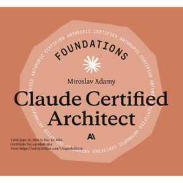
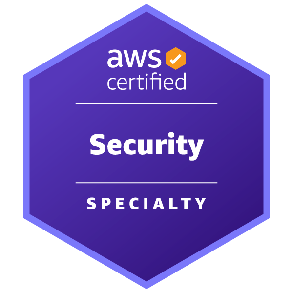
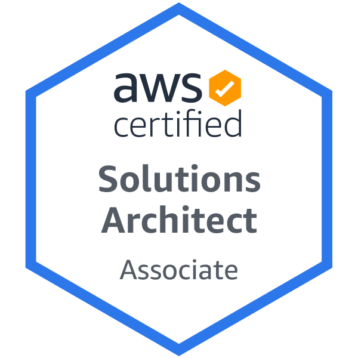
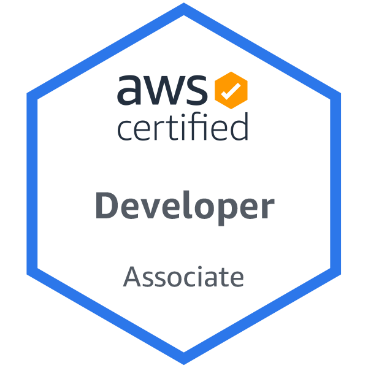
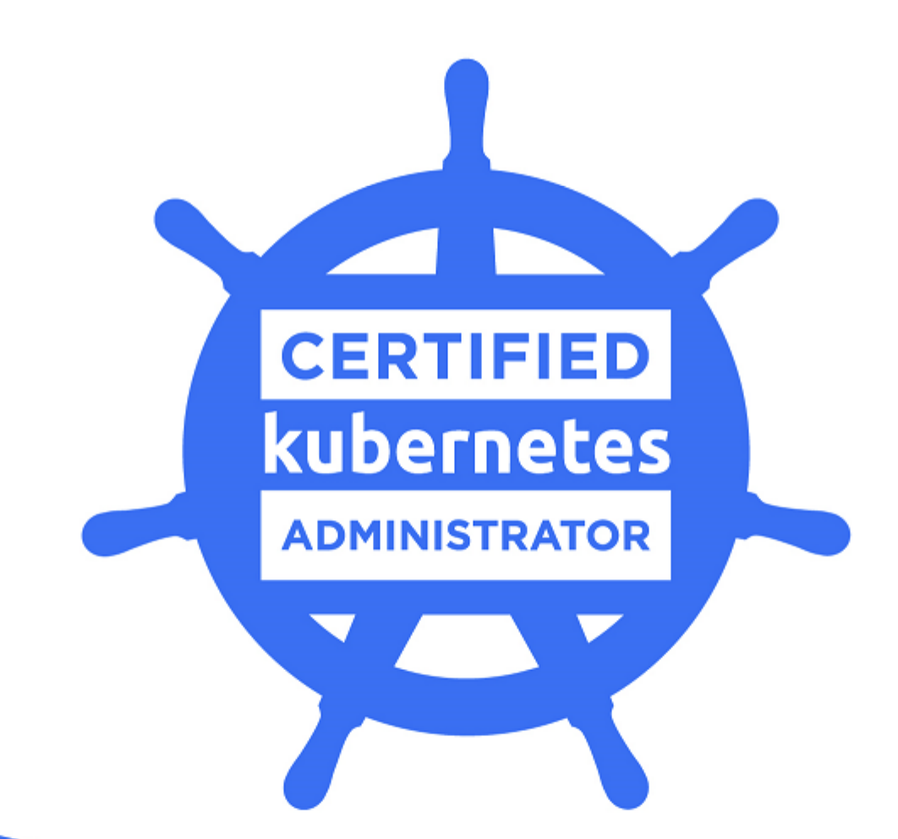

  
  
  
  
  

*MIRO dot ADAMY at KLASSIFY dot COM*

## Senior DevOps / AWS Cloud Architect / SRE Engineer for Hire

Senior DevOps / Cloud Engineer and Software Architect with 20+ years in IT and 10+ years building, automating, and operating large-scale distributed platforms on AWS - with Python, IaaC, CI/CD, and Kubernetes across public and private cloud.

Now working where cloud meets AI: bringing the same platform-engineering rigour to machine learning and large language models - designing the Python automation, pipelines, and infrastructure that take LLM- and AI-powered systems to production reliably and at scale.

A proven track record of improving efficiency and scalability for e-commerce and enterprise applications, and a multi-lingual professional who has worked and lived in 7 countries across two continents.

My expertise is further emphasized by my AWS certifications: Solutions Architect, Developer and Advanced - Security Specialty as well as Claude Certified Architect.

### Highly Skilled DevOps Professional

I am proficient in Infrastructure as Code (IaC) using Terraform, CI/CD pipelines, and container orchestration with Kubernetes (Certified Kubernetes Administrator certification).

### Extensive IT Experience

In addition to my specialized DevOps skills, I bring over 20 years of overall IT experience to the table. This broad knowledge base allows me to approach challenges from a comprehensive perspective.

### Flexible Work Arrangements

I am available for both short-term (2+ months) and long-term engagements (12+ months), preferably as a freelancer. I am open to full-time as well as part-time projects.

Currently, I work remotely from the EU time zone (GMT+1) for clients across Europe, the UK, Switzerland, Canada, and the USA.

I am also open to hybrid projects within Central Europe (CZ, SK, AT, IT, CH, DE) depending on the specifics. Additionally, I can work on-site for shorter assignments in Bratislava or Vienna.

### Multilingual Capabilities

My ability to communicate effectively in English, German, Spanish, Slovak (native) and Czech is a valuable asset for collaborating with diverse teams and clients.

### Dual Citizenship

I hold dual citizenship in the European Union (Slovakia) and Canada.

## Learn More

For a detailed overview of my skills and certifications, please visit my online portfolio at [miro-adamy.gitlab.io](https://miro-adamy.gitlab.io/) or my resume at [github.com/miroadamy/resume](https://github.com/miroadamy/resume/blob/main/miro-adamy-cv.pdf).

### Online Portfolio

[https://miro-adamy.gitlab.io/](https://miro-adamy.gitlab.io/)

### Resume - downloadable file

- PDF: [miro-adamy-cv.pdf](https://github.com/miroadamy/resume/blob/main/miro-adamy-cv.pdf)
- Markdown: [miro-adamy-cv.md](https://github.com/miroadamy/resume/blob/main/miro-adamy-cv.md)

## Looking for

Here is a quick summary what I am looking for:

- B2B (contract / freelance) projects only, no permanent employment
- either fully remote or hybrid, no fully on-site
- if hybrid, then within Bratislava, Vienna, Brno triangle
- I am not interested in relocation at this time; exceptions: Italy, Switzerland (specially Ticino), Südtirol/Alto Adige
- client location: EU, Switzerland, UK, Canada, USA (East Coast) - GMT+2 to GMT-4 timezones
- available for part time projects (up to 2-3 days / week)
- I am OK with short term (2 months+) up to mid-term (< 12 months) project duration
